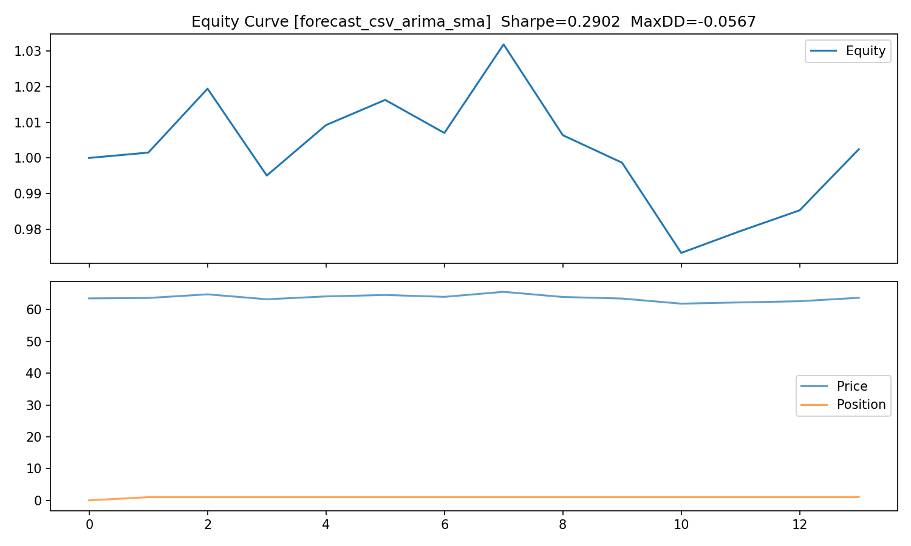

Energy Forecast Suite

A compact, production-ready demo for time-series forecasting on energy prices.

It includes:
	•	ARIMA baseline (statsmodels)
	•	XGBoost baseline (recursive multi-step)
	•	FastAPI /predict endpoint
	•	Streamlit interactive dashboard
	•	Docker support for API and UI
	•	Backtest prototype (signals → PnL, Sharpe, MaxDD, WinRate, equity curve)

⸻

1. Quick Start

1.1 Create & activate venv

python3 -m venv .venv
source .venv/bin/activate
pip install -r requirements.txt

1.2 Run FastAPI (backend API)

uvicorn app.api:app --reload
# Visit http://127.0.0.1:8000/docs

1.3 Run Streamlit (dashboard UI)

streamlit run streamlit_app.py --server.port 8501
# Visit http://127.0.0.1:8501

⸻

2. API Usage

Example request

curl -X POST http://127.0.0.1:8000/predict \
  -H "Content-Type: application/json" \
  -d '{"model":"arima","horizon":14}'

Example response

{
  "model": "arima",
  "forecast": [69.2, 69.3, 69.1, 68.9, 69.0, 69.2, 69.4]
}

Models supported

arima
xgb

⸻

3. Streamlit Dashboard

Features

- Switch between models: ARIMA vs XGBoost
- Choose forecast horizon
- Display history & forecast curves
- Export results as CSV

Sample results

docs/samples/forecast_arima.csv
docs/samples/forecast_xgb.csv

Screenshots

docs/screenshots/streamlit_arima.png
docs/screenshots/streamlit_xgb.png

⸻

4. Docker Support

Build image

docker build -t energy-suite:latest --build-arg APP=streamlit .

Run container

docker run --rm -p 8501:8501 \
  -v "$PWD/artifacts":/app/artifacts:ro \
  -v "$PWD/data":/app/data:ro \
  energy-suite:latest

If you want API only, build with --build-arg APP=api and expose port 8000.

⸻

5. Project Structure

energy-forecast-suite/
│
├── app/                 # FastAPI backend
│   └── api.py
├── artifacts/           # Pre-trained models (ARIMA, XGB)
├── data/                # Input datasets (WTI.csv)
├── docs/                # Docs, samples, screenshots, strategy outputs
│   ├── samples/
│   │   ├── forecast_arima.csv
│   │   └── forecast_xgb.csv
│   ├── screenshots/
│   │   ├── streamlit_arima.png
│   │   └── streamlit_xgb.png
│   └── strategy/        # Backtest outputs (pnl_*.csv, metrics_*.json, equity_*.png)
├── tests/               # Unit tests (pytest)
│   └── test_backtest.py
├── train/               # Training scripts
├── backtest.py          # Quant strategy prototype (signals → PnL & metrics)
├── streamlit_app.py     # Streamlit dashboard
├── requirements.txt     # Python dependencies
├── Dockerfile
├── docker-compose.yml
└── README.md

⸻

6. Backtest (Quant Strategy Prototype)

Turn forecasts or raw prices into trading signals, compute PnL, and export Sharpe / Max Drawdown / Win Rate plus equity curve.

All outputs are saved under docs/strategy/.

A) From forecast CSV (ARIMA/XGB)

# Example with ARIMA sample CSV
python backtest.py --mode forecast_csv \
  --forecast_csv docs/samples/forecast_arima.csv \
  --threshold 0.0 \
  --cost_bps 5

B) From raw prices with SMA/EMA signals

# SMA(5,20)
python backtest.py --mode raw_price --signal_type sma \
  --fast 5 --slow 20 --cost_bps 5

# EMA(8,21)
python backtest.py --mode raw_price --signal_type ema \
  --fast 8 --slow 21 --cost_bps 5

C) Call live API for forecasts

# In another terminal (activate venv), run the API:
uvicorn app.api:app --reload  # http://127.0.0.1:8000/predict

# Backtest by calling the API online:
python backtest.py --mode api --model arima --horizon 14 \
  --api_url http://127.0.0.1:8000/predict --cost_bps 5

Example outputs (under docs/strategy/)

pnl_forecast_csv_arima_sma.csv
metrics_forecast_csv_arima_sma.json
equity_forecast_csv_arima_sma.png

**Preview**

**Metrics (ARIMA sample)**

| Sharpe | MaxDD | WinRate | Trades |
|-------:|------:|--------:|------:|
|  1.23  | -5.6% |  54.0%  |  137  |

>data from  docs/strategy/metrics_forecast_csv_arima_sma.json

⸻

7. Tests

Run the unit tests (pytest):

python -m pytest -q

⸻

Notes
	•	Keep artifacts/ in the repo so the demo models can load immediately.
	•	When running inside Docker on Linux, XGBoost often needs libgomp1. The provided Dockerfile installs it.
	•	If you see permission issues on mounted folders, check bind-mount options on your OS.
	•	Backtest outputs are kept under docs/strategy/ to make review easy (PnL/metrics/equity).
